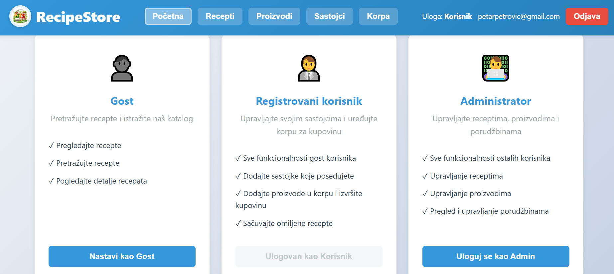
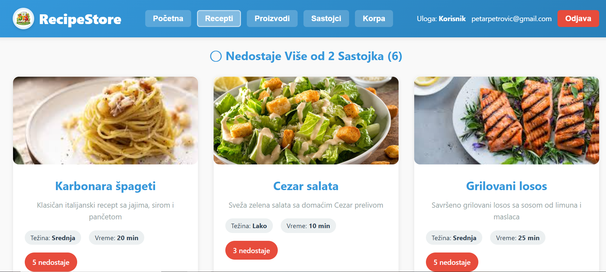
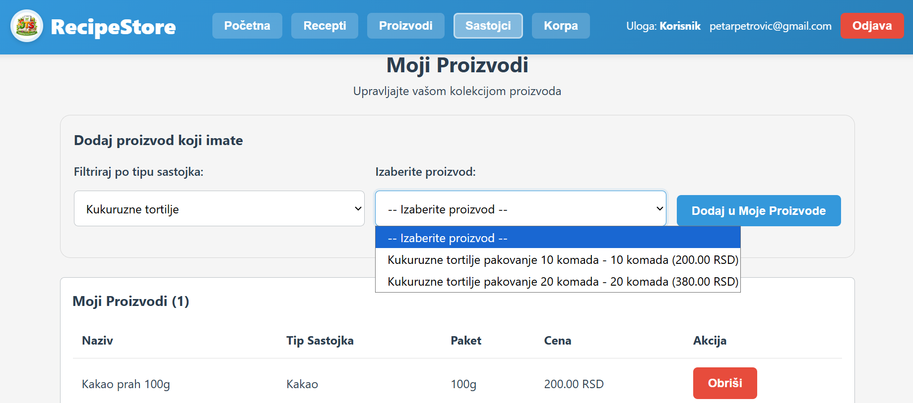
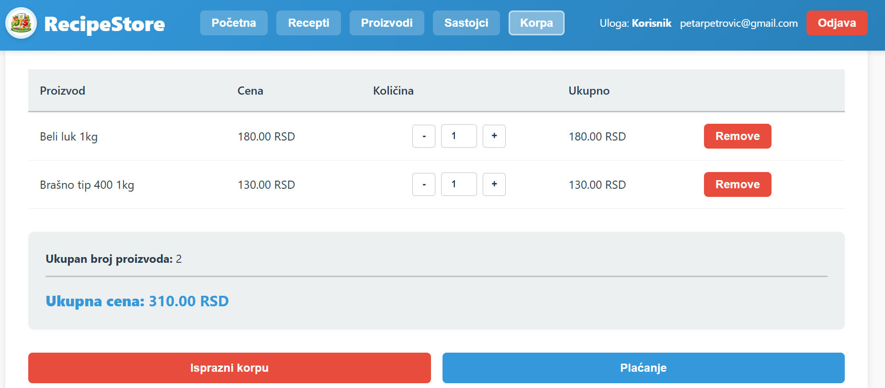
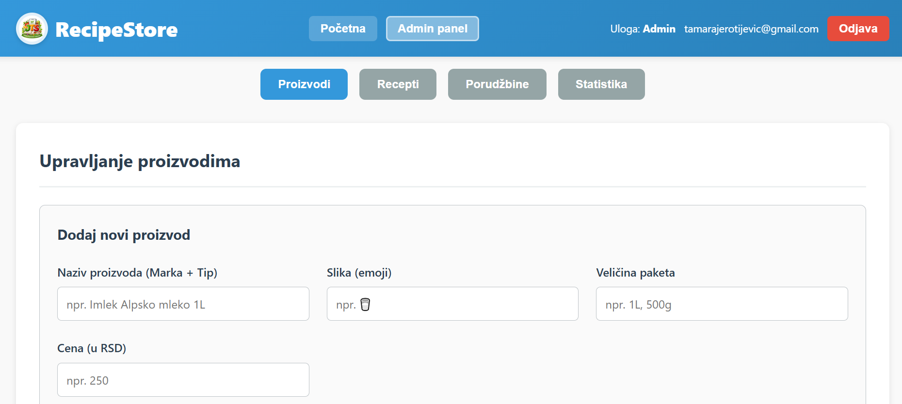
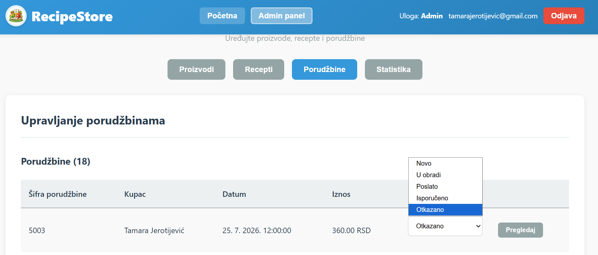
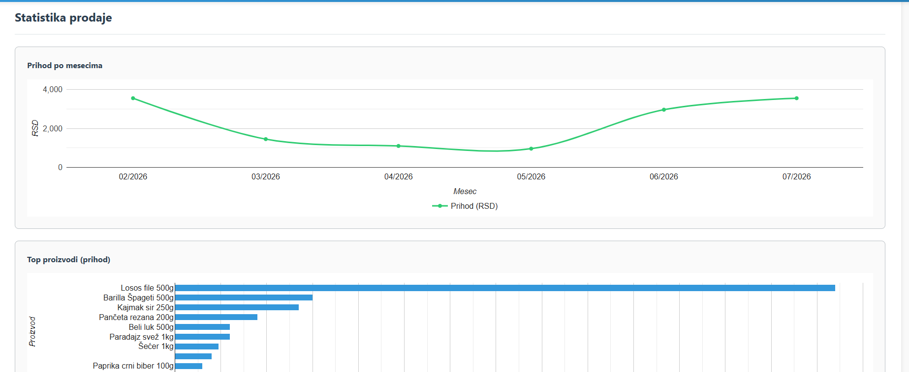

# RecipeStore 
RecipeStore is a full-stack web application that helps users discover recipes based on the ingredients they already have. Users can browse recipes, manage their pantry, save favorite recipes, organize shopping through a cart system, and access an intuitive interface designed for a smooth user experience.

## Technologies
### Frontend:
- React
- JavaScript
- Bootstrap

### Backend:
- Node.js
- Express
- Sequelize

### Database:
- MySQL

### Other
- Docker
- Swagger
- JWT
- Render
- GitHub Actions

## Features

- User authentication (JWT)
- Browse and search recipes
- Filter recipes
- Favorite recipes
- Shopping cart
- Admin Dashboard
- Nutritional information (Spoonacular API)
- Public recipe suggestions (TheMealDB API)

## Live Demo
- Frontend: https://internet-tehnologije-2025-ovoj.onrender.com
- Backend: https://internet-tehnologije-2025-qkec.onrender.com

## Local Setup

Clone the repository:

```bash
git clone https://github.com/tamarajerotijevic/Recipe-website.git
cd Recipe-website
```
Install dependencies:
```bash
cd backend
npm install

cd ../frontend
npm install
```
Create the required .env files and configure your database connection.

Run database migrations and seed data:

```bash
npx sequelize-cli db:migrate
npx sequelize-cli db:seed:all
```

Start the backend:

```bash
npm start
```

Start the frontend:
```bash
npm run dev
```


## Swagger

```md
## API Documentation 
 
Swagger UI is available at: 
http://localhost:3001/api-docs 

```

## Enviroment variables

Backend:

- DB_USER
- DB_PASS
- DB_NAME
- DB_HOST
- DB_PORT
- DB_DIALECT
- JWT_SECRET
- JWT_EXPIRES_IN
- SPOONACULAR_API_KEY

Frontend:

- VITE_API_URL

## CI/CD

GitHub Actions pipeline:

- Runs tests on every push and pull request
- Builds and publishes a Docker image to GHCR
- Automatically deploys the application to Render

## External APIs

The application integrates with TheMealDB API to provide recipe inspiration.

Recipes fetched from the external API are displayed separately and do not affect the application's local products or shopping cart.

## Docker
 
### 1. Running with Docker
 
Run the following command from the project's root directory:

```bash
 
docker compose up --build
```
 
To run the containers in detached mode:

```bash
 
docker compose up --build -d

```
 
This command starts:
- MySQL
- phpMyAdmin
- backend
- frontend
 
### 2. Running Database Migrations and Seeders
 
After the containers are up and running, execute the database migrations and seed the initial data

```bash
 
docker compose exec backend npx sequelize-cli db:migrate
docker compose exec backend npx sequelize-cli db:seed:all

```
 
### 3. Available Services
 
Frontend:
http://localhost:5173
 
Backend:
http://localhost:3001
 
phpMyAdmin:
http://localhost:8080
 
MySQL:
localhost:3308
 
### 4. Stopping the Containers

```bash
 
docker compose down
```
 
To remove the containers along with the Docker volumes (database data):
```bash
 
docker compose down -v
```


## Developed as a university team project

## What I learned

Through this project I gained experience with:

- Building a full-stack application using React and Node.js
- Designing REST APIs
- Managing relational databases with MySQL and Sequelize
- Authentication using JWT
- Docker containerization
- Deploying applications to Render
- CI/CD using GitHub Actions
- Working with Docker Compose